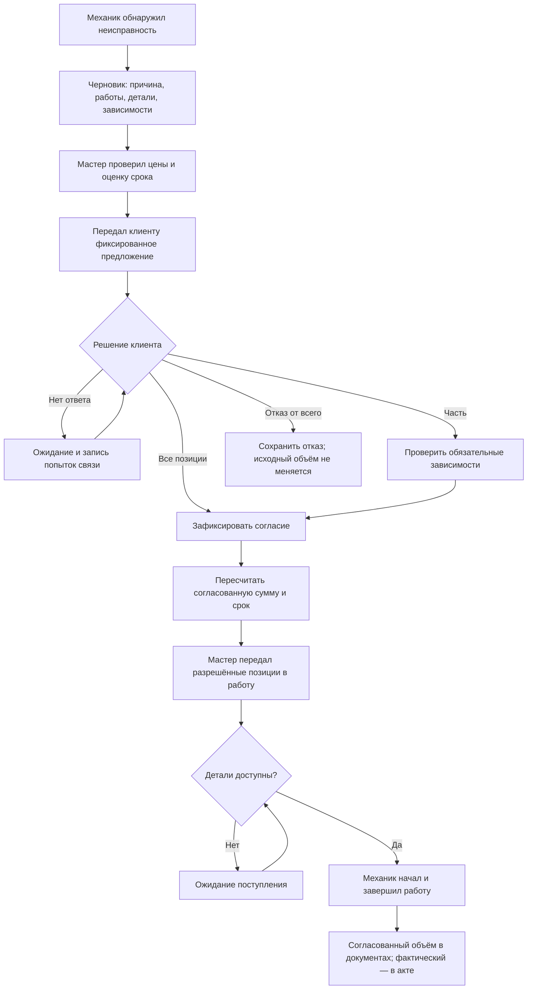
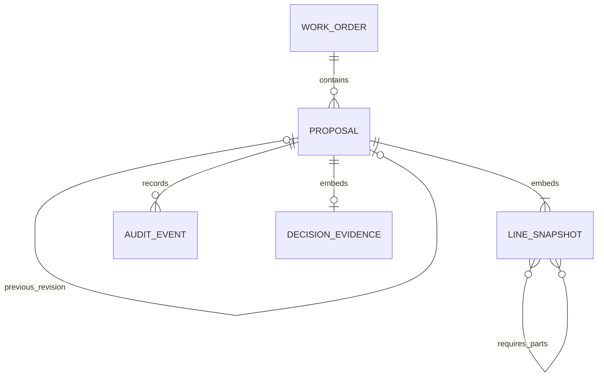

# Согласование дополнительных работ и запчастей

Проектирование и работающий прототип модуля автосервиса **ServiceFlow**.

Сценарий: автомобиль уже принят, исходный состав заказ-наряда согласован. Механик находит дополнительные неисправности. Нужно получить решение клиента, не потерять его условия и передать в выполнение только разрешённый объём.

Главный инвариант: **обнаруженная неисправность и подготовленное предложение сами по себе не дают разрешения на работу и не увеличивают согласованную стоимость**.

## 1. Вопросы заказчику

1. Кто вправе согласовывать ремонт со стороны клиента: собственник, водитель, представитель организации? Как проверяются полномочия и ограничения по сумме?
2. Какие способы подтверждения допустимы: телефон, сообщение, email, подпись? Какие доказательства нужно хранить и сколько времени?
3. Разрешено ли согласие на отдельные позиции, пакеты работ, предельную сумму или альтернативные варианты? Можно ли согласовывать часть количества одной позиции?
4. Как связывать работы с обязательными запчастями? Допустимы материалы клиента, аналоги и замена артикула без изменения цены?
5. Кто создаёт техническую рекомендацию, кто определяет цену, кто отправляет предложение и кто фиксирует согласие? Может ли один сотрудник совмещать эти роли?
6. Что входит в цену: налоги, скидки, нормо-часы, расходники? Как долго действует предложение и что делать при изменении закупочной цены?
7. Когда резервировать запчасти, где источник наличия и сроков поставки? Кто оплачивает невозвратный заказ, если клиент передумал?
8. Как рассчитывать срок: календарные/рабочие дни, загрузка постов, параллельные операции, выходные, ожидание деталей? Нужно ли отдельно подтверждать новый срок?
9. Что делать при отзыве согласия после начала работ или заказа запчасти? Кто утверждает компенсацию, остановку ремонта и корректирующие документы?
10. Как долго ждать клиента, кто и когда напоминает? Есть ли допустимые аварийные действия без предварительного согласия и как оформлять нарушение?
11. Какие системы уже есть: заказ-наряды, склад, прайс-лист, телефония, мессенджеры, бухгалтерия? Какие API, события и ограничения интеграции доступны?
12. Какие документы нужны клиенту и руководителю, кто может исправлять ошибочную запись, какие требования к журналу, доступам и хранению персональных данных?

## 2. Принятые предположения

| Предположение | Причина и следствие |
| --- | --- |
| Исходный заказ уже существует и согласован | Не дублируем приёмку, регистрацию и весь контур автосервиса |
| Согласие явно задаётся по каждой позиции | Отсутствие ответа всегда означает отсутствие разрешения |
| Позиция согласуется целиком | Частичное количество заранее разбивается на строки; нет неоднозначного распределения цены |
| Работа может требовать конкретные запчасти из предложения | Нельзя разрешить технически невыполнимый набор; для разных работ нужны отдельные количества деталей |
| Цена и состав фиксируются в момент передачи | Иначе согласие относилось бы к изменяемому документу |
| Новая редакция отзывает предыдущую до начала исполнения | Снижает риск параллельного использования двух цен. Все позиции пересогласуются заново |
| Новые неисправности оформляются отдельным предложением | Уже начатые и согласованные работы продолжают иметь собственное основание |
| Отменять согласованное до начала может руководитель с причиной | Сохраняется разделение ответственности и след отмены |
| После начала нет обычного «отменить и забыть» | Нужен отдельный процесс урегулирования фактических затрат; в демо такая отмена блокируется |
| Стоимость — рубли с точностью до копейки, количество целое | Храним целые копейки, не используем float для расчётов; цена трактуется как окончательная за единицу |
| Мастер отмечает фактическую передачу и полученное решение вручную | Внешние каналы, подписи и идентификация клиента не входят в локальный срез |
| Срок — расчётная оценка | В демо: исходный срок + согласованные минуты работ × количество + максимальное ожидание отсутствующей детали; календарь и загрузка не моделируются |

Переключение ролей не является авторизацией. В демонстрации используется вымышленный клиент, одна организация, один заказ и четыре фиксированных сотрудника. В рабочей системе личность должна приходить из существующей сессии, а не из клиентского заголовка.

## 3. Бизнес-процесс

1. Механик описывает неисправность и необходимость ремонта. На реальном объекте к этому добавляются фотографии/диагностика.
2. В черновике формируются независимые позиции и обязательные зависимости. Мастер проверяет цену, наличие и срок. Ошибочную строку можно удалить до передачи; изменение остаётся в истории.
3. Мастер передаёт клиенту состав, количество, цену и ожидаемое изменение срока. В системе фиксирует канал, получателя и комментарий; предложение становится неизменяемым по коммерческим полям.
4. Мастер фиксирует полученное решение по всем строкам. При выборе работы её обязательные детали должны быть согласованы. Для телефонного решения обязательны контакт, время, сотрудник и комментарий.
5. В одной транзакции меняются версия, статус, решения по строкам и история. Стоимость и срок вычисляются по подтверждённому состоянию. Запрос со старой версией получает конфликт.
6. После проверки мастер разрешает исполнение. Механик видит только допустимые действия. Начать работу можно при наличии согласия, разрешения и нужных деталей.
7. При начале работы связанные детали считаются выданными. Отдельно согласованные независимые запчасти механик может выдать отдельной операцией. Завершение также попадает в историю.
8. В сводке заказ-наряда представлены исходные и действующие согласованные дополнительные позиции с реквизитами согласования. Акт выполненных работ должен формироваться по фактическому исполнению и является отдельным документом в рабочей системе.

Пример: исходно 18 500 ₽. Колодки: работа 2 800 ₽ + детали 6 400 ₽. Ремень: работа 1 800 ₽ + деталь 2 400 ₽. Согласованы только колодки: итог **27 700 ₽**, плюс **60 минут**. Полное согласие: **31 900 ₽**, плюс **100 минут** и **1 календарный день** ожидания ремня. Полный отказ оставляет **18 500 ₽**.

## 4. Роли и права

| Действие | Механик | Мастер-приёмщик | Руководитель | Кассир |
| --- | --- | --- | --- | --- |
| Смотреть заказ, предложения, историю, документы | Да | Да | Да | Да |
| Создавать / редактировать черновик | Да | Да | Да | Нет |
| Передавать клиенту, фиксировать решение | Нет | Да | Да | Нет |
| Разрешать выполнение согласованных позиций | Нет | Да | Да | Нет |
| Начинать/завершать разрешённую работу, выдавать детали | Да | Нет | Да | Нет |
| Отмечать поступление детали | Нет | Да | Да | Нет |
| Отменить / перевыпустить ещё не согласованное | Нет | Да | Да | Нет |
| Отозвать / перевыпустить согласованное до начала | Нет | Нет | Да, с причиной | Нет |
| Добавить комментарий / попытку связи | Да | Да | Да | Нет |
| Менять исходную историю либо исполненное согласие | Нет | Нет | Нет | Нет |

Допуск механика к ценам черновика — самостоятельное упрощение демо. В реальном процессе можно разделить технический состав и коммерческую оценку мастером. Право руководителя выполнять действия механика также требует подтверждения заказчиком.

Запрещены: молчаливое согласие, скрытое увеличение цены, исполнение до согласия и разрешения, принятие работы без нужной согласованной детали, перенос старого согласия на новую редакцию, стирание истории, принятие конфликта версий по принципу «последний перезаписал».

Журналируются создание, изменения черновика, передача клиенту, решения, разрешение работ, поступление деталей, начало/завершение, выдача, отмена, новая редакция, комментарии. Для каждого события: сотрудник, роль, серверное время UTC, причина/комментарий, снимки до и после. Неуспешная операция откатывается целиком. В production отказы доступа и технические ошибки дополнительно направляются в защищённый журнал безопасности.

## 5. Статусы и переходы

Не смешиваем три разных оси: жизненный цикл документа, решение клиента и фактическое выполнение.

| Ось | Значения |
| --- | --- |
| Документ | `draft` → `awaiting` → `decided`; допустима `cancelled` |
| Итог решения (вычисляется) | `full`, `partial`, `rejected` |
| Каждая позиция | `pending`, `accepted`, `declined` |
| Допуск к исполнению | `released=false/true` для действующего согласованного предложения |
| Работа | `idle` → `in_progress` → `completed` |
| Запчасть | `idle` → `consumed`; наличие хранится отдельно |

Интерфейс выводит человеку понятные статусы: «Черновик», «Ожидает решения», «Согласовано полностью/частично», «Отклонено», «Передано в работу», «Выполнено», «Отменено».

Переходы защищены сервисным слоем. «Ожидает запчасть» вычисляется из состояния обязательных деталей и не меняет факт согласия. «Клиент не ответил» остаётся ожиданием и не приравнивается к отказу. Завершено всё предложение, когда каждая согласованная работа завершена, а согласованные детали выданы.

Новая редакция: старое предложение получает `cancelled`, новое — `draft`, увеличивается номер редакции и сохраняется `parent_id`. Номер редакции — бизнес-сущность, а `version` — счётчик всех конкурентно защищённых изменений внутри конкретной редакции.

## 6. Ошибочные и нестандартные ситуации

| Ситуация | Поведение |
| --- | --- |
| Согласована часть | Фиксируем все решения. В цену и разрешённый объём входят только принятые строки. Необходимые детали проверяются сервером |
| После согласия выросла цена | Не редактируем старое согласие. До начала руководитель отзывает редакцию и создаёт новую с повторным согласием. Если меняется только добавочный объём уже начатого ремонта — отдельное предложение |
| Детали нет на складе | Показываем срок поставки; согласие допустимо, но начало зависимой работы заблокировано. После поступления мастер вносит запись, работа становится доступной |
| Клиент передумал до начала | Руководитель отменяет с причиной. Дополнительная сумма исключается, доказательство исходного согласия сохраняется |
| Клиент передумал после начала | Обычная отмена запрещена. В реальной системе: остановить доступные операции, зафиксировать фактическое исполнение и затраты, согласовать урегулирование. Демо не рассчитывает компенсацию автоматически |
| Неверная строка | В черновике исправить/удалить с историей. После передачи — новая редакция. После начала — отдельное корректирующее событие через будущий процесс урегулирования |
| Два сотрудника изменяют | Атомарный `UPDATE ... WHERE version = expected` пропускает одного. Второму HTTP 409; интерфейс закрывает устаревшую форму и загружает актуальные данные |
| Работа начата до согласия | API возвращает конфликт. Если физически начали вне системы, мастер вносит запись об инциденте и привлекает руководителя; нельзя задним числом подделывать согласие |
| Клиент не отвечает | Предложение остаётся ожидающим. Попытки связи записываются комментарием. Таймеры/напоминания и срок действия предложения — следующий этап после ответа заказчика |
| Решение по телефону | Обязательны способ, собеседник, время решения с часовым поясом и содержательный комментарий. Сотрудник и время внесения определяются системой |
| Новые неисправности после начала | Новое предложение в том же заказе. Исходная редакция и уже выполняемые позиции не переписываются |
| Работа принята, обязательная деталь отклонена | UI помогает выбрать согласованный набор; API отклоняет противоречивый запрос независимо от интерфейса |
| Повторное нажатие / повтор решения | Кнопки блокируются на время запроса; версия и статус не допускают повторного принятия решения и двойного увеличения суммы |
| Обрыв связи после отправки | UI сообщает о проблеме. Если сохранение подтверждено, но чтение не удалось, просит обновить экран. Для production нужен idempotency key на создание предложения и внешние сообщения |
| Решение имеет неверную дату | Отсекаем время в будущем, без часового пояса и раньше передачи предложения |
| Изменилась доступность детали | Факт поступления фиксируется без изменения цены. Новая задержка, не предусмотренная сроком предложения, требует пересогласования; реальный календарь поставок — интеграционная задача |

Ограничение текущего среза: полный пересмотр редакции возможен только до начала любой её позиции. Частичный отзыв не начатой позиции внутри уже исполняемого предложения требует отдельной модели корректировок. Это явно не замаскировано под «удалить строку».

## 7. Функциональные требования и критерии приёмки

| ID | Требование | Проверяемый результат |
| --- | --- | --- |
| FR-01 | Механик создаёт предложение | При валидных работах/деталях появляется черновик. Исходная стоимость не меняется. Запись есть в истории |
| FR-02 | Мастер фиксирует передачу | При указании канала, получателя, комментария статус — ожидание. Цена и состав больше не редактируются |
| FR-03 | Мастер сохраняет частичное решение | Если приняты только колодки, согласованная сумма 27 700 ₽; ремень отсутствует в документе |
| FR-04 | Нельзя принять несогласованный комплект | Принятие работы при отказе от обязательной детали возвращает 422; решение и версия не меняются |
| FR-05 | Полный отказ | Все строки отклонены, дополнительные начисления равны нулю, разрешение выполнения недоступно |
| FR-06 | Разрешение и выполнение разделены | Согласие без разрешения мастера не позволяет механику начать. После разрешения доступны только согласованные позиции |
| FR-07 | Учитывается наличие | Работа с отсутствующей обязательной деталью не начинается; после отметки поступления начинается |
| FR-08 | Исполнение фиксируется | Начало выдаёт связанные детали; завершить можно только начатую работу; повторное начало отклоняется |
| FR-09 | Контроль одновременных изменений | Два запроса с одной версией: один успешен, один 409. В журнале только одно успешное изменение |
| FR-10 | Смена цены требует новой редакции | PUT согласованного предложения отклоняется. Новая редакция — черновик без перенесённого согласия |
| FR-11 | Отзыв согласия контролируется | Мастер не может отменить согласованное. Руководитель может до исполнения; после исполнения получает конфликт |
| FR-12 | История объясняет стоимость | Событие решения показывает до/после и разницу согласованной суммы, автора, время, способ и комментарий |
| FR-13 | Документы содержат разрешённый объём | Сводка включает исходные и согласованные активные позиции, исключает ожидающие, отклонённые и отменённые |
| FR-14 | Данные переживают перезапуск | После остановки и запуска сохраняются решения; seed не создаёт повторный заказ |
| FR-15 | Интерфейс удобен локально | Нет экрана входа, тема сохраняется, доступен экран на 390 px, ошибки сервера видны и есть повтор загрузки |

Проверки бизнес-инвариантов: [`backend/tests/test_workflow.py`](../backend/tests/test_workflow.py). Браузерные сценарии: [`frontend/e2e/workflow.spec.ts`](../frontend/e2e/workflow.spec.ts). Команды и CI — в README.

## 8. Данные и технические решения

`LINE_SNAPSHOT` и `DECISION_EVIDENCE` на схеме — логические сущности внутри JSON-полей предложения, не отдельные таблицы текущего SQLite-хранилища.

| Сущность | Основные данные |
| --- | --- |
| Заказ-наряд | ID, номер, клиент, автомобиль, пробег, исходные строки и исходный срок |
| Предложение | UUID, ID заказа, предыдущая редакция, номер редакции, version, название, причина, статус, разрешение исполнения, даты |
| Снимок позиции | ID внутри предложения, работа/деталь, название, количество, цена в копейках, длительность на единицу, поставка, наличие, обязательные детали, решение, исполнение |
| Передача | Способ, получатель, комментарий, сотрудник, серверное время передачи |
| Подтверждение решения | Способ, собеседник, время получения, время записи, сотрудник, комментарий; решения — на каждой строке |
| Событие истории | Последовательный ID, заказ, предложение, действие, сотрудник/роль, причина, время, снимки до и после |
| Итоги | Исходная цена, действующая согласованная добавка, ожидающая добавка и текущий срок; вычисляются, не дублируются как изменяемые суммы |

**Архитектура.** Один FastAPI-модуль, реляционное хранение, один Next.js-клиент. Для этого объёма не нужны микросервисы, брокер или отдельный event-sourcing-контур. SQLAlchemy выполняет роль доступа к данным; отдельный репозиторий, который только повторяет ORM, не добавлен. Бизнес-операции централизованы в `ProposalService`, расчёты — в `domain.py`, валидация входных данных — в Pydantic. Клиент не является источником истины для прав и итогов.

**Транзакции.** Каждое изменение: получить агрегат → условно увеличить version → проверить переход → изменить снимок → записать событие → commit. При исключении откатываются и version, и данные, и история. Сумма заказа выводится из действующих согласованных предложений, поэтому два разных предложения не перезаписывают общий счётчик денег. Для нескольких процессов seed потребует отдельной миграционной/инициализационной команды; демо запускает один worker.

**Хранение снимков.** Предложение ограничено 50 позициями, его изменение атомарно. JSON сохраняет точный состав и цену редакции и упрощает переносимый прототип. Для поиска по артикулам, аналитики большого объёма и настоящего склада нужны нормализованные строки и движения склада. История в API только добавляется; администратор БД технически может её изменить. Для юридически значимого журнала нужны отдельные права, retention и защита от подмены.

**Время и деньги.** Серверные даты — UTC с часовым поясом; интерфейс показывает МСК. Форма времени решения использует локальную временную зону браузера и отправляет ISO с зоной. Деньги в копейках, округление только при переводе введённой цены в копейки. Количество и длительность проверяются. После согласия согласованная сумма не зависит от того, нажал ли механик «начать».

**Следующий этап интеграции.** PostgreSQL и Alembic; настоящая сессия/роли и область видимости организации; прайс-лист и артикулы; резервирование; ресурсный календарь; idempotency keys; outbox и подтверждение доставки; вложения и подписанные доказательства; согласование изменённого срока; корректировки после начала; документы по шаблонам заказчика; резервное копирование, наблюдаемость и восстановление. Всё это следует оценивать после знакомства с существующей системой.

## 9. Ключевой экран

Реальный интерфейс доступен сразу после запуска на localhost:3000.

- Верхняя карточка: автомобиль, номер, пробег, клиент, мастер, текущая стадия ремонта.
- Вкладки: дополнительные работы, история, документы. Слева повторяются ключевые разделы для быстрого перехода.
- Основная область: выбор предложения/редакции, причина, шаги процесса, таблица работ и деталей, зависимости, количество, сумма и решение.
- Справа: неизменяемая исходная сумма, согласованная добавка, текущий итог и отдельно ожидающая добавка. Ни одна ожидающая сумма не выдаётся за согласованную.
- Форма решения: явно выбранный результат каждой строки, автоматическая помощь с зависимостями, предпросмотр добавки, способ/время/контакт/комментарий.
- Механик видит «Начать»/«Завершить» только для разрешённых строк; отсутствие детали видно рядом с работой.
- История: понятное описание события, сотрудник, время и изменение денег; технические снимки скрыты под раскрывающимся «Что изменилось».
- Документы: только действующий согласованный состав с подтверждениями, печать, JSON.
- Светлая/тёмная тема и адаптивная раскладка. Диалоги Chakra UI управляют фокусом и Escape; формы имеют labels, уведомления — live regions, активные вкладки — ARIA-состояния. На мобильном таблица прокручивается внутри карточки.

## 10. Использование Codex и проверка результата

Реализация подготовлена с Codex. ИИ использовался для анализа условий, декомпозиции, генерации и редактирования backend/frontend, тестов, документации и локальных проверок. Этот документ не приписывает автоматически созданный код ручному написанию кандидатом.

Основной запрос пользователя: «Сделай проект на Next.js + Python/FastAPI; чистый структурированный код, Chakra UI, тёмная и светлая темы; удобный локальный запуск; фронтенд и бэкенд в одной репе; выполнить приложенное задание». Уточнение пользователя: не публиковать личные ответы об условиях сотрудничества в репозитории.

Ниже — три воспроизводимые формулировки рабочих подзадач, на которые был разложен запрос, а не выдуманный журнал отдельных сообщений кандидата:

1. «Выдели инварианты согласования дополнительных работ. Раздели состояние предложения, решение каждой позиции и исполнение. Учти зависимости деталей, отзыв согласия и конкурентные изменения. Опиши допущения и непокрытые интеграции».
2. «Реализуй вертикальный срез: FastAPI/SQLite с транзакциями и журналом, Next.js/Chakra UI с формами, ролями демо, светлой и тёмной темами. Итог считай только на сервере по действующим согласиям. Сохрани воспроизводимый локальный запуск».
3. «Проверь через API запреты и ошибки, затем браузером частичное согласие → передача → выполнение → документы. Проверь конфликты версий, повторные запросы, склад, перезапуск, мобильную ширину и сохранение темы. Исправь найденные проблемы».

Использованные результаты: структура приложения, бизнес-правила, реализованный интерфейс, набор автоматических проверок, Docker/локальный launcher, проектный документ.

Что корректировалось в ходе работы:

- Согласование и выполнение разделены, чтобы утверждённое предложение не означало автоматически начатую работу.
- Введены обязательные связи работ с деталями и серверная проверка; одной отметки в UI недостаточно.
- Перевыпуск редакции не наследует согласие и не затирает историю старой цены.
- Первый вариант загрузки React вызвал замечание линтера о синхронном обновлении состояния в effect; загрузка разделена на начальную асинхронную и ручное обновление.
- Внешняя загрузка шрифта заменена поставкой через npm, чтобы после установки приложение не зависело от Google Fonts.
- Для браузерных тестов выделены отдельная БД в памяти, порты и директория сборки: тестовый сценарий не должен портить данные демонстрации.
- В браузере обнаружена ошибка гидратации Emotion с Turbopack. Dev и build переведены на Webpack по [официальной рекомендации Chakra UI](https://chakra-ui.com/docs/get-started/frameworks/next-app#hydration-errors-turbopack), после чего проверка повторяется с контролем ошибок страницы.
- Сквозной тест выявил пограничный случай времени: округлённое до секунды решение могло оказаться раньше только что отправленного предложения. Для значения «сейчас» сохранена исходная точность времени; для вручную введённого времени серверная проверка остаётся строгой.

Проверка результата: тесты FastAPI с временной файловой SQLite, реальная гонка двух запросов, тест перезапуска; TypeScript/ESLint, production-сборка Next.js; Playwright-проход основного сценария и форм, темы, роли кассира и мобильной ширины; проверка локального launcher. Проверки входят в GitHub Actions. Реальные результаты запуска и ограничения окружения фиксируются в итоговом сообщении, а не заменяются предположением «тесты должны пройти».

До использования в рабочем сервисе кандидат должен самостоятельно пройти сценарии, разобраться в переходах и подтвердить бизнес-допущения с заказчиком. Формально проходящие тесты не заменяют верификацию этих решений.
